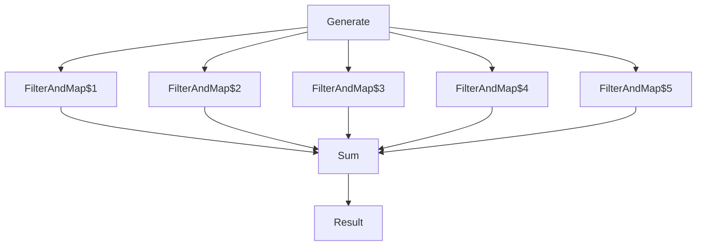
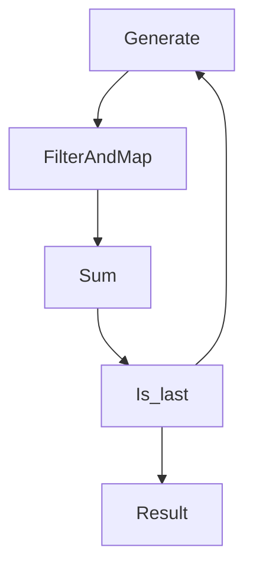

## Time Measure

```text
Pipeline
Res: 12170256750000600
Duration: 490.875121ms
Sequence
Res: 12170256750000600
Duration: 1.902003809s
```
## Arch

### Pipeline

```mermaid
graph TD;
Generate-->FilterAndMap$1
Generate-->FilterAndMap$2
Generate-->FilterAndMap$3
Generate-->FilterAndMap$4
Generate-->FilterAndMap$5
FilterAndMap$1-->Sum
FilterAndMap$2-->Sum
FilterAndMap$3-->Sum
FilterAndMap$4-->Sum
FilterAndMap$5-->Sum
Sum-->Result
```
### Sequence

```mermaid
graph TD;

Generate --> FilterAndMap
FilterAndMap --> Sum
Sum --> Is_last
Is_last-->Generate
Is_last-->Result
```

